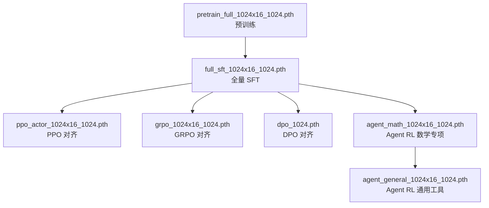

# MiniMind 模型演进族谱

> 本文档记录 `out/` 目录下各阶段模型的训练来源与演进关系。
> 模型规格统一为：`hidden_size=1024`，`num_hidden_layers=16`（约 26M Non-Embedding 参数，总参数约 104M）。

## 一、族谱总览

```text
pretrain_full_1024x16_1024.pth          (预训练, 09-12 00:01)
        │
        ▼
full_sft_1024x16_1024.pth               (全量 SFT, 09-12 16:23)
        │
        ├──────────────┬──────────────┬──────────────────────┐
        ▼              ▼              ▼                      ▼
ppo_actor_1024x16     grpo_1024x16   dpo_1024.pth       agent_math_1024x16
_1024.pth             _1024.pth      (DPO 对齐)          _1024.pth
(PPO 对齐,            (GRPO 对齐,                        (Agent RL 数学专项,
 09-13 09:59)           09-13 23:06)    (09-14 09:26)       09-15 15:36)
                                                                 │
                                                                 ▼
                                                       agent_general_1024x16
                                                       _1024.pth
                                                       (Agent RL 通用工具,
                                                        09-17 10:40)
```

Mermaid 版本：



## 二、各模型详细信息

### 1. pretrain_full_1024x16_1024.pth — 预训练基座

| 项目 | 内容 |
|---|---|
| 训练脚本 | `trainer/train_pretrain.py` |
| 训练方式 | 全量预训练（Next Token Prediction） |
| 产出时间 | 2026-09-12 00:01 |
| 日志 | `logs/pretrain_full_1024x16.log` |
| 下游模型 | `full_sft_1024x16_1024.pth` |

预训练阶段，模型在海量通用语料上学习语言建模能力，是所有后续模型的共同祖先。

### 2. full_sft_1024x16_1024.pth — 全量 SFT

| 项目 | 内容 |
|---|---|
| 父模型 | `pretrain_full_1024x16_1024.pth` |
| 训练脚本 | `trainer/train_full_sft.py` |
| 训练方式 | 全量参数监督微调（指令对话数据） |
| 产出时间 | 2026-09-12 16:23 |
| 日志 | `logs/full_sft_1024x16.log` |
| 下游模型 | `ppo_actor` / `grpo` / `dpo` / `agent_math` |

SFT 阶段让基座模型学会遵循指令、进行多轮对话，是四条对齐/强化学习分支的共同起点。

### 3. ppo_actor_1024x16_1024.pth — PPO 对齐分支

| 项目 | 内容 |
|---|---|
| 父模型 | `full_sft_1024x16_1024.pth` |
| 训练脚本 | `trainer/train_ppo.py` |
| 训练方式 | PPO（Actor-Critic，基于 Reward Model 的强化学习） |
| 产出时间 | 2026-09-13 09:59 |
| 日志 | `logs/ppo_actor_1024x16.log` |
| 下游模型 | 无（独立对齐分支） |

### 4. grpo_1024x16_1024.pth — GRPO 对齐分支

| 项目 | 内容 |
|---|---|
| 父模型 | `full_sft_1024x16_1024.pth` |
| 训练脚本 | `trainer/train_grpo.py` |
| 训练方式 | GRPO（Group Relative Policy Optimization，组内相对优势，无需独立 Critic） |
| 产出时间 | 2026-09-13 23:06 |
| 日志 | `logs/grpo_1024x16.log` |
| 下游模型 | 无（独立对齐分支） |

### 5. dpo_1024.pth — DPO 对齐分支

| 项目 | 内容 |
|---|---|
| 父模型 | `full_sft_1024x16_1024.pth` |
| 训练脚本 | `trainer/train_dpo.py` |
| 训练方式 | DPO（Direct Preference Optimization，偏好对，chosen/rejected 直接优化） |
| 产出时间 | 2026-09-14 09:26 |
| 日志 | `logs/dpo_1024x16.log` |
| 下游模型 | 无（独立对齐分支） |

### 6. agent_math_1024x16_1024.pth — Agent RL 数学专项

| 项目 | 内容 |
|---|---|
| 父模型 | `full_sft_1024x16_1024.pth` |
| 训练脚本 | `trainer/train_agent.py` |
| 训练数据 | `dataset/agent_rl_math.jsonl`（约 20,000 条数学工具调用样本） |
| 训练方式 | Agent RL（CISPO 损失，多轮工具调用 rollout + 组内相对优势） |
| 关键配置 | `batch_size=4`，`num_generations=2`，`max_seq_len=768`，`max_gen_len=512`，`max_total_len=1600`，`lr=3e-7` |
| 产出时间 | 2026-09-15 15:36 |
| 日志 | `logs/agent_math_1024x16.log` |
| 下游模型 | `agent_general_1024x16_1024.pth` |

数学专项阶段，模型学习在数学计算场景中调用 `calculate_math` 等工具并给出正确答案。训练全程 5000 steps（1 epoch），最终平均 Reward 约 2.0+（满分 3.0）。

### 7. agent_general_1024x16_1024.pth — Agent RL 通用工具（最新）

| 项目 | 内容 |
|---|---|
| 父模型 | `agent_math_1024x16_1024.pth` |
| 训练脚本 | `trainer/train_agent.py` |
| 训练数据 | `dataset/agent_rl.jsonl`（约 39,988 条通用多场景工具调用样本） |
| 训练方式 | Agent RL（CISPO 损失，多轮工具调用 rollout + 组内相对优势） |
| 关键配置 | `batch_size=4`，`num_generations=2`，`max_seq_len=768`，`max_gen_len=512`，`max_total_len=1600`，`lr=1e-7` |
| 产出时间 | 2026-09-17 10:40 |
| 日志 | `logs/agent_general_1024x16.log` |
| 下游模型 | 无（当前族谱最新节点） |

通用工具阶段，在数学专项模型基础上继续训练，覆盖普通对话、天气查询、单位转换、翻译等多场景工具调用。训练全程 9997 steps（1 epoch）。

## 三、训练时间线

```text
09-11 ~ 09-12 00:01   pretrain_full    预训练
09-12 16:23           full_sft         全量 SFT
09-13 09:59           ppo_actor        PPO 对齐
09-13 23:06           grpo             GRPO 对齐
09-14 09:26           dpo              DPO 对齐
09-15 15:36           agent_math       Agent RL（数学专项）
09-17 10:40           agent_general    Agent RL（通用工具）
```

## 四、断点续训文件

每个训练阶段在 `checkpoints/` 目录下均有对应的 resume 断点（含模型权重、optimizer、scheduler 与 step 状态），中断后可通过 `--from_resume 1` 恢复：

```text
checkpoints/agent_general_1024x16_1024_resume.pth
checkpoints/agent_math_1024x16_1024_resume.pth
...
```

## 五、说明

- `ppo_actor` / `grpo` / `dpo` 三条对齐分支相互独立，均直接从 `full_sft` 出发，用于对比不同偏好对齐算法的效果。
- Agent RL 分支采用串行演进（`full_sft → agent_math → agent_general`），先在数学场景收敛工具调用格式，再泛化到通用多工具场景。
- 所有模型文件均为 428M（fp32 state_dict），规格一致，可互换加载推理。
